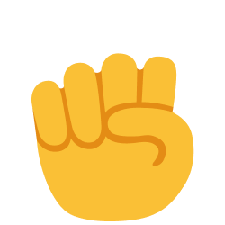
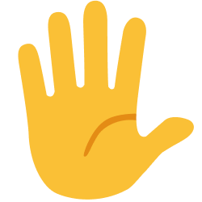
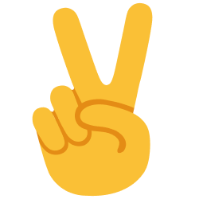

# rock-paper-scissors
<html>
      <head>
         <title>ROCK-PAPER-SCISSOR</title>
         <link rel="stylesheet" href="rock-paper-scissors.css">
      </head>
      <body>
         
rock paper scissors

         <button onclick="playerGame('rock')" class="move-icon"></button>

         <button onclick="playerGame('paper')" class="move-icon"></button>

         <button onclick="playerGame('scissor')" class="move-icon"></button>

         <button onclick="
         score.wins=0;
         score.losses=0;
         score.ties=0;
         localStorage.removeItem('score');
         updateScore();
         " class="reset">reset</button>

         

         

         

         
      </body>
   </html>
